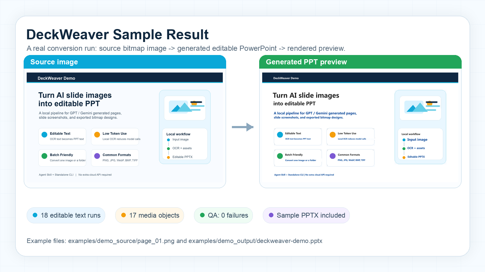
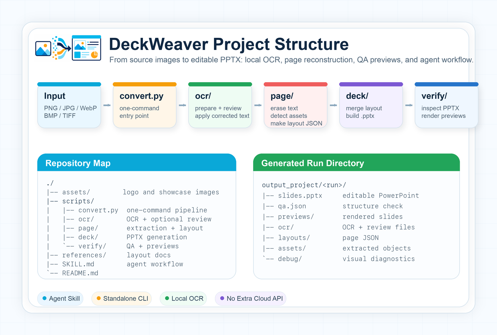

<p align="center">
  
</p>

# DeckWeaver

中文 | [English](README_EN.md)

DeckWeaver 可以把 GPT、Gemini等输出的图片重建为可编辑的 PowerPoint 文件。它可以作为Agent的Skill使用，或者直接作为一个无大模型介入的命令行工具。

几乎所有的图片上的文字都会被还原成可编辑的 PPT 文本框，图标、Logo、图片和装饰元素等也会拆成独立图片对象。

## 优点

- 几乎所有文字和图标都可以在 PowerPoint 里继续编辑、移动或替换。
- Token 消耗很低（作为命令行工具甚至可以无token消耗）：主体流程使用本地 OCR 和图像算法，不需要把整页反复交给云端多模态模型。
- 生成速度快：批量 OCR 复用热模型，后续页面流水线自动完成。
- 无需额外云端 API：OCR、图像分割、PPTX 生成和预览检查都在本地运行。
- 支持常见位图输入：PNG、JPG/JPEG、WebP、BMP、TIF/TIFF。

## 效果展示

<p align="center">
  
</p>

示例输入图片在 [examples/demo_source/page_01.png](examples/demo_source/page_01.png)，生成的可编辑 PPT 在 [examples/demo_output/deckweaver-demo.pptx](examples/demo_output/deckweaver-demo.pptx)。

## 快速开始

### 方式一：作为 Skill / Agent 工具使用


1. 克隆项目，或者直接克隆到你的 skill 目录：

```bash
git clone https://github.com/GuopengLin/Image2PPT.git
```

2. 用 Codex、Claude Code 或其他本地 agent 打开项目目录。


3. 把要转换的图片或图片文件夹告诉 agent，例如：

```text
请使用这个项目里的 skill，把 /path/to_dir 文件夹下的所有图片转换成一个可编辑 PPT。
```

也可以指定单张图片：

```text
请使用这个项目里的 skill，把 /path/to/page_01.png 转换成可编辑 PPT。
```

**注意** 首次运行时，agent 会先执行 `bash scripts/bootstrap.sh` 安装依赖，可能需要一定的耗时。最终结果在 `output_project/<run>/slides.pptx`。

### 方式二：作为独立命令行工具使用

适合以下几类用户：

- 不想要消耗token

- 对于文字正确性要求不高（因为不会有大模型介入文字识别）

- 想要借助命令行实现大批量识别

```bash
git clone https://github.com/GuopengLin/Image2PPT.git
cd Image2PPT
bash scripts/bootstrap.sh
```

`bootstrap.sh` 会安装 Python 依赖、本地 OCR 依赖、LibreOffice/Poppler 预览工具，并预下载模型缓存。macOS 和常见 Linux 发行版可直接使用；Windows 或受管环境可参考 `requirements.txt` 手动安装依赖。


然后一键运行：

```bash
python scripts/convert.py --source /path/to/slides
```

也可以直接处理单张图片：

```bash
python scripts/convert.py --source /path/to/page_01.png
```

生成结果会在：

```text
output_project/<run>/
├── slides.pptx       # 最终可编辑 PPT
├── qa.json           # PPTX 结构检查报告
├── previews/         # 预览图，用于人工比对
├── ocr/              # OCR 与可选人工复核文件
├── layouts/          # 页面布局 JSON
├── assets/           # 提取出的图片对象
└── debug/            # 调试可视化
```

如果需要调试，也可以把一键流程拆成三步手动运行：

```bash
RUN="output_project/demo_$(date +%Y%m%d_%H%M%S)"
SRC="slides"

python scripts/ocr/prepare_ocr.py \
  --source-dir "$SRC" \
  --work-dir "$RUN"

python scripts/ocr/ocr_review_apply.py --work-dir "$RUN"

python scripts/build_deck.py \
  --source-dir "$SRC" \
  --work-dir "$RUN"
```

如果 `build_deck.py` 提示有 OCR 不确定项，可以打开 `ocr/page_NN.ocr_review.annotated.png` 检查高亮文字，修改对应 `ocr_review.json` 的 `corrected_text` 后重新运行后两步。

## 常用参数

```bash
python scripts/convert.py --source slides --pages 1,3,8
python scripts/convert.py --source slides --skip-render
python scripts/convert.py --source slides --detect-tables
python scripts/convert.py --source slides --icon-review
python scripts/ocr/prepare_ocr.py --pages 1,3,8 ...
python scripts/build_deck.py --skip-render ...
python scripts/build_deck.py --detect-tables ...
python scripts/build_deck.py --icon-review ...
```

- `--pages`：只处理指定页。
- `--skip-render`：跳过 LibreOffice 预览渲染。
- `--detect-tables`：尝试把规则表格还原为 PPT 原生表格。
- `--icon-review` / `--icon-decisions`：导出图标/文字边界判断包，便于人工复核。

## 项目结构

<p align="center">
  
</p>

```text
.
├── assets/            # Logo 与展示图片
├── examples/          # 示例输入图片与生成的 PPTX
├── scripts/
│   ├── convert.py    # 一键转换入口
│   ├── ocr/          # OCR、交叉验证、复核应用
│   ├── page/         # 单页擦除文字、检测元素、生成布局
│   ├── deck/         # 合并布局并生成 PPTX
│   ├── verify/       # PPTX 检查与预览渲染
│   ├── tables/       # 可选表格识别
│   └── optional/     # 可选后处理工具
├── references/       # 布局格式与流程说明
├── SKILL.md          # skill 工作流说明
└── requirements.txt
```

## 注意事项

- 一键入口支持单张图片或图片文件夹；如果图片没有按 `page_NN.<ext>` 命名，会自动复制到运行目录并按页码编号。
- 多页 PPT 最好保持一致比例；PowerPoint 一个文件只能有一种页面尺寸。
- 复杂图表目前会优先作为可移动图片对象保留，而不是还原为可编辑数据图表。
- 生成文件默认写入 `output_project/`，该目录不会提交到 Git。

## 致谢与第三方声明

本项目的部分 PPTX 布局构建、布局格式说明、重建流程说明和 PPTX 检查工具参考并改编自 [soulmujoco/EditableImage2PPTSkill](https://github.com/soulmujoco/EditableImage2PPTSkill)。原项目使用 MIT License，详见 [THIRD_PARTY_NOTICES.md](THIRD_PARTY_NOTICES.md)。

## 联系方式

商业授权、定制开发或问题反馈：1015277323@qq.com

## License

个人免费使用、复制和修改，但副本或修改版需要注明来源并保留项目名、版权声明、许可证和原始仓库链接。商业使用、商业分发、SaaS/内部生产系统集成等场景需要先联系作者购买商业授权。详见 [LICENSE](LICENSE)。
