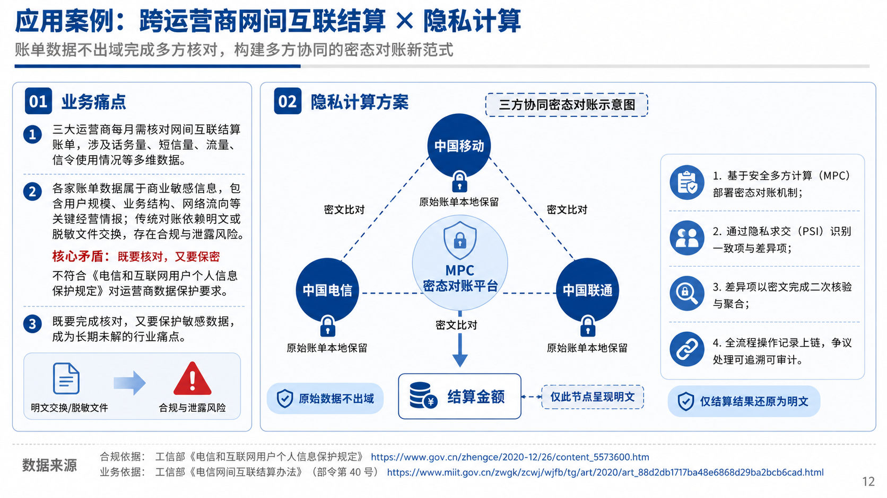
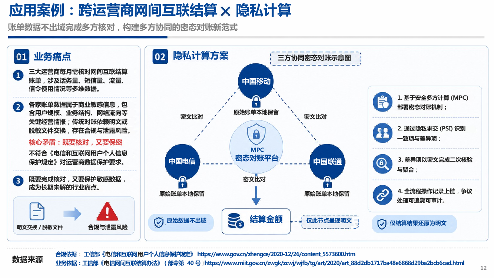

<p align="center">
  
</p>

# DeckWeaver

[中文](README.md) | English

<p align="center">
  
  
  
  
  
</p>

DeckWeaver rebuilds images generated by GPT, Gemini, and similar tools into editable PowerPoint files. It can be used as an agent skill, or directly as a standalone command-line tool without any large-model involvement.

Nearly all text in the source image is restored as editable PPT text boxes, while icons, logos, pictures, and decorative elements are split into independent picture objects.

## Highlights

- Nearly all text and icons can still be edited, moved, or replaced in PowerPoint.
- Very low token usage, and even zero token usage when used as a command-line tool: the main pipeline uses local OCR and image algorithms, so it does not repeatedly send whole slides to cloud multimodal models.
- Fast generation: batch OCR reuses warm models, and the remaining page stages run automatically.
- No extra cloud API required: OCR, image segmentation, PPTX generation, and preview checks all run locally.
- Supports common bitmap inputs: PNG, JPG/JPEG, WebP, BMP, TIF/TIFF.

## Example

The image on the left is the input (a GPT-generated privacy-computing diagram); the image on the right is the `.pptx` rebuilt by DeckWeaver, rendered back to PNG via LibreOffice. Every text element is an editable text box, and the three telecom operator icons, the central MPC lock, the connectors, etc. are extracted as independent, movable PNG objects.

<table>
  <tr>
    <td align="center"><b>Input</b></td>
    <td align="center"><b>Rebuilt PPT (preview)</b></td>
  </tr>
  <tr>
    <td></td>
    <td></td>
  </tr>
</table>

Reproduce this example (~30 seconds, local PaddleOCR + LibreOffice):

```bash
python scripts/convert.py --source "input/<your_image>.png"
# → output/<image_stem>_<YYYYMMDD>/slides.pptx
```

## Quick Start

### Option 1: Use As A Skill / Agent Tool

1. Clone the project, or clone it directly into your skill directory:

```bash
git clone https://github.com/GuopengLin/Image2PPT.git
```

2. Open the project directory with Codex, Claude Code, or another local agent.

3. Tell the agent which image or image folder you want to convert, for example:

```text
Please use the skill in this project to convert all images under /path/to_dir into an editable PPT.
```

You can also specify a single image:

```text
Please use the skill in this project to convert /path/to/page_01.png into an editable PPT.
```

**Note**: On the first run, the agent will run `bash scripts/bootstrap.sh` to install dependencies, which may take some time. The final result is written to `output/<run>/slides.pptx`.

### Option 2: Use As A Standalone CLI Tool

This is suitable if you:

- do not want to use tokens;
- do not need LLM-level text verification;
- want to batch-convert images from the command line.

```bash
git clone https://github.com/GuopengLin/Image2PPT.git
cd Image2PPT
bash scripts/bootstrap.sh
```

`bootstrap.sh` installs Python dependencies, local OCR dependencies, LibreOffice/Poppler preview tools, and pre-downloads model caches. It works directly on macOS and common Linux distributions. On Windows or managed environments, you can install dependencies manually with `requirements.txt`.

Then run the one-command pipeline:

```bash
python scripts/convert.py --source /path/to/slides
```

You can also process a single image:

```bash
python scripts/convert.py --source /path/to/page_01.png
```

The generated result is written to:

```text
output/<run>/
├── slides.pptx       # final editable PowerPoint deck
├── qa.json           # PPTX structure inspection report
├── previews/         # rendered previews for manual comparison
├── ocr/              # OCR files and optional review files
├── layouts/          # page layout JSON files
├── assets/           # extracted picture objects
└── debug/            # debug visualizations
```

For debugging, you can also split the one-command flow into three manual steps:

```bash
RUN="output/demo_$(date +%Y%m%d)"
SRC="slides"

python scripts/ocr/prepare_ocr.py \
  --source-dir "$SRC" \
  --work-dir "$RUN"

python scripts/ocr/ocr_review_apply.py --work-dir "$RUN"

python scripts/build_deck.py \
  --source-dir "$SRC" \
  --work-dir "$RUN"
```

If `build_deck.py` reports uncertain OCR entries, open `ocr/page_NN.ocr_review.annotated.png` to inspect the highlighted text, edit `corrected_text` in the corresponding `ocr_review.json`, then rerun the last two steps. By default, when `--skip-render` is not used, `build_deck.py` first renders text-only calibration previews to adjust font sizes, then runs multiple passes to adjust text box positions.

## Common Options

```bash
python scripts/convert.py --source slides --pages 1,3,8
python scripts/convert.py --source slides --skip-render
python scripts/convert.py --source slides --detect-tables
python scripts/convert.py --source slides --icon-review
python scripts/ocr/prepare_ocr.py --pages 1,3,8 ...
python scripts/build_deck.py --skip-render ...
python scripts/build_deck.py --detect-tables ...
python scripts/build_deck.py --icon-review ...
```

- `--pages`: process only selected pages.
- `--skip-render`: skip LibreOffice preview rendering and the default text calibration.
- `--skip-calibration`: skip preview-based text size and position calibration only.
- `--font-calibration-iterations 1`: set font-size calibration passes.
- `--calibration-iterations 4`: set text position calibration passes.
- `--detect-tables`: try to rebuild regular tables as native PowerPoint tables.
- `--icon-review` / `--icon-decisions`: export icon/text boundary review packets for manual checks.

## Project Layout

```text
.
├── assets/            # logo and project assets
├── scripts/
│   ├── convert.py    # one-command conversion entry point
│   ├── ocr/          # OCR, cross-verification, review application
│   ├── page/         # per-page text erasing, element detection, layout generation
│   ├── deck/         # layout merging and PPTX generation
│   ├── verify/       # PPTX inspection and preview rendering
│   ├── tables/       # optional table recognition
│   └── optional/     # optional post-processing tools
├── references/       # layout format and workflow documentation
├── SKILL.md          # skill workflow instructions
└── requirements.txt
```

## Notes

- The one-command entry supports a single image or a folder of images. If images are not named as `page_NN.<ext>`, they are copied into the run directory and numbered automatically.
- Multi-page decks work best when all source images share the same aspect ratio. PowerPoint only supports one slide size per file.
- Complex charts are currently preserved as movable picture objects first, instead of being rebuilt as editable data charts.
- Generated files are written to `output/` by default, and this directory is not committed to Git.

## Acknowledgements

Parts of the PPTX layout builder, layout reference documentation, reconstruction workflow notes, and PPTX inspection helper are adapted from [soulmujoco/EditableImage2PPTSkill](https://github.com/soulmujoco/EditableImage2PPTSkill). The original project uses the MIT License. See [THIRD_PARTY_NOTICES.md](THIRD_PARTY_NOTICES.md).

## Contact

Commercial licensing, customization, or feedback: 1015277323@qq.com

## License

Free for personal use, copying, and modification, provided copies or modified versions clearly attribute the source and retain the project name, copyright notice, license, and original repository link. Commercial use, commercial distribution, SaaS/internal production system integration, and similar scenarios require contacting the author to purchase a commercial license. See [LICENSE](LICENSE).
